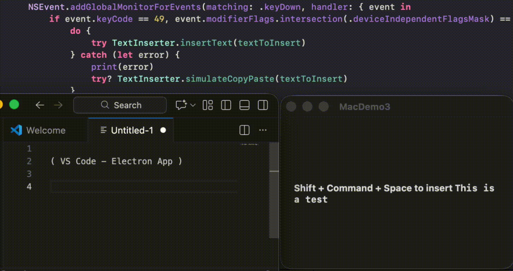

# SwiftUI_InsertTextToOtherApplication

A demo of inserting text to active (focused) applications using two different approaches.

- With Application Services's Accessibility API. Specially AXUIElementSetAttributeValue + kAXSelectedTextAttribute
- Simulating the paste (⌘+V) command . (Copying is just adding to the NSPasteboard. Nothing special!)

For more details, please refer to my blog: [Swift/MacOS: Insert Text to (Other) Active Applications Two Ways]()

Will work for 
- MacOS native apps such as notes, pages,
- Web ones such as Gmail, Google Docs, or
- Electron Apps such as Slack or VSCode!

**Tested Supported App**

| App | Type | Support |
|-----|------|-----------------|
| Notes.app | Native macOS | ✅ |
| TextEdit | Native macOS | ✅ |
| Xcode | Native macOS | ✅ |
| Mail.app | Native macOS | ⚠️ |
| Pages | Native macOS | ⚠️ |
| Slack | Electron | ⚠️ |
| Gmail (Chrome) | Web | ⚠️ |
| Google Docs | Web | ⚠️ |
| VSCode | Electron | ⚠️ |
| Notion | Electron | ⚠️ |

- ✅: With Accessibility API
- ⚠️: By simulating copy and paste command
    - This might fail for non QWERTY keyboard layout

